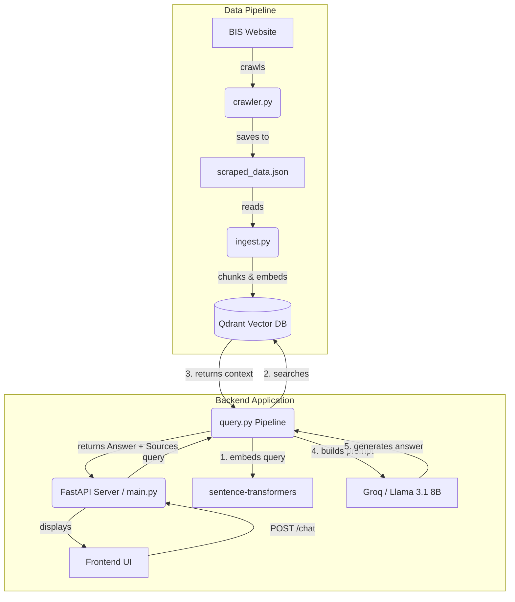

# BIS Assistant (RAG Chatbot)

A complete production-ready AI chatbot that answers questions about the Bureau of Indian Standards (BIS) website (https://www.bis.gov.in) using a Retrieval-Augmented Generation (RAG) architecture.

## Architecture Diagram



## Features

- **Recursive Crawler**: Extracts main text content from the BIS website.
- **RAG Pipeline**: Retrieves up to 5 most relevant chunk context limits.
- **Out-of-Scope Detection**: Instructed specifically to reject non-BIS queries.
- **Multi-turn Memory**: Remembers context from previous questions within a session.
- **Modern UI**: Simple Tailwind CSS chat interface with citations.
- **Vector Storage**: Uses Qdrant for fast and efficient nearest-neighbor search.

## Setup Instructions

### Prerequisites
- Python 3.9+
- Groq API Key (free at [console.groq.com](https://console.groq.com))

### 1. Backend Setup

1. Open a terminal in the `backend/` directory.
2. Install dependencies:
   ```bash
   pip install -r requirements.txt
   ```
3. Set your Groq API key in `.env` or as an environment variable:
   - Get a free API key from [console.groq.com](https://console.groq.com)
   - Create a file named `.env` in the `backend/` directory.
   - Add: `GROQ_API_KEY="your-api-key-here"`

### 2. Running the Data Pipeline (Ingestion)

*Note: You must do this first!*

1. **Scrape Data:**
   ```bash
   python crawler.py
   ```
   *This saves `scraped_data.json`.*
2. **Chunk and Embed:**
   ```bash
   python ingest.py
   ```
   *This creates local vector database storage `qdrant_db/`.*

### 3. Start the Server

1. Run the FastAPI development server:
   ```bash
   uvicorn main:app --reload
   ```
2. The server will run on `http://localhost:8000`.

### 4. Running the Frontend

The frontend is a static HTML page. Simply open `frontend/index.html` in your web browser. 
(You can double-click it, or start a simple HTTP server: `python -m http.server 3000` from the frontend folder).

## Deployment Instructions

### Deploying the Backend (Render)

1. Commit your repository to GitHub.
2. Log into [Render](https://render.com/).
3. Create a new **Web Service**.
4. Connect the GitHub repository.
5. Setup Settings:
   - Root Directory: `backend`
   - Build Command: `pip install -r requirements.txt`
   - Start Command: `uvicorn main:app --host 0.0.0.0 --port 10000`
6. Add Environment Variable:
   - `GROQ_API_KEY` = `your-api-key`
7. Ensure the `qdrant_db` folder (or Qdrant Cloud details) is correctly configured if persistent storage is required across builds. (Recommendation: Spin up a free Qdrant Cloud cluster, update `ingest.py` and `query.py` with URL and API Key).

### Deploying the Frontend (Vercel)

1. Update the `API_URL` variable inside `frontend/index.html` (line 117):
   ```javascript
   const API_URL = 'https://your-render-backend-url.onrender.com/chat';
   ```
2. Go to [Vercel](https://vercel.com/) and create a new project.
3. Import your GitHub repository.
4. Set the Root Directory to `frontend`.
5. Deploy (Vercel will easily host the static HTML).
